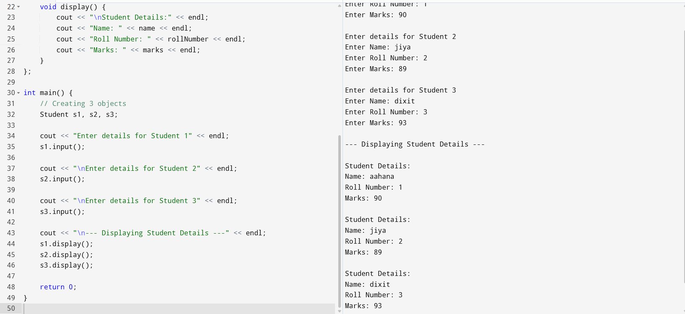
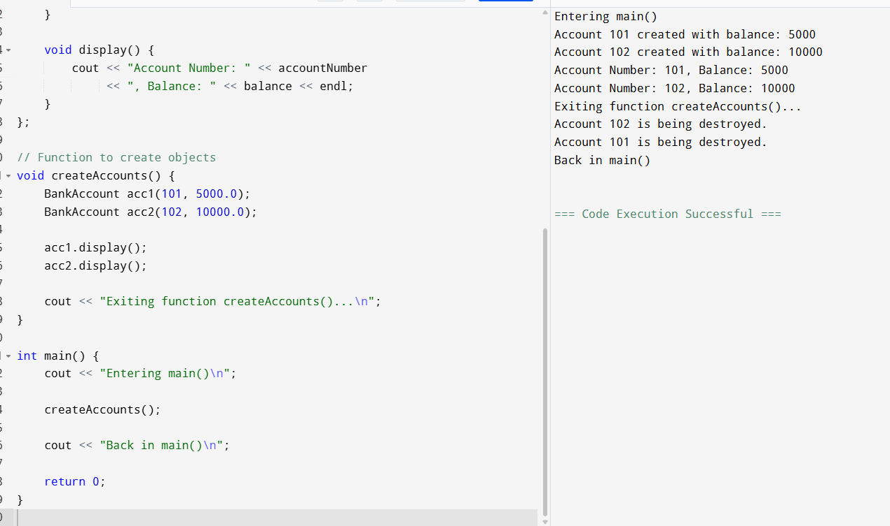
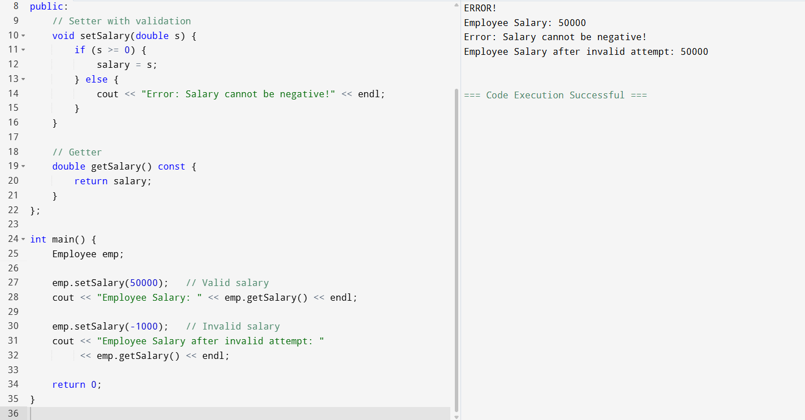
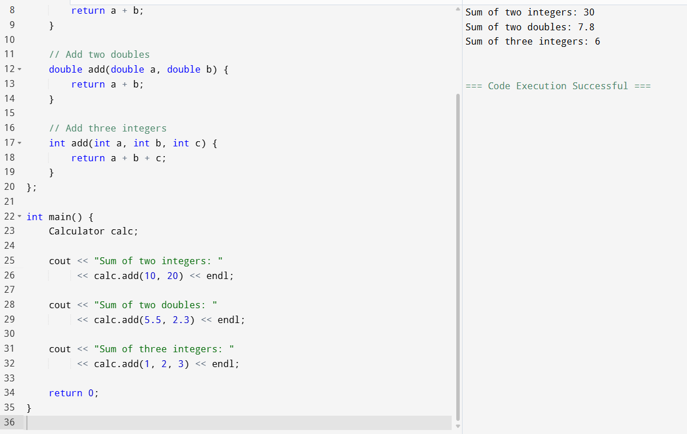
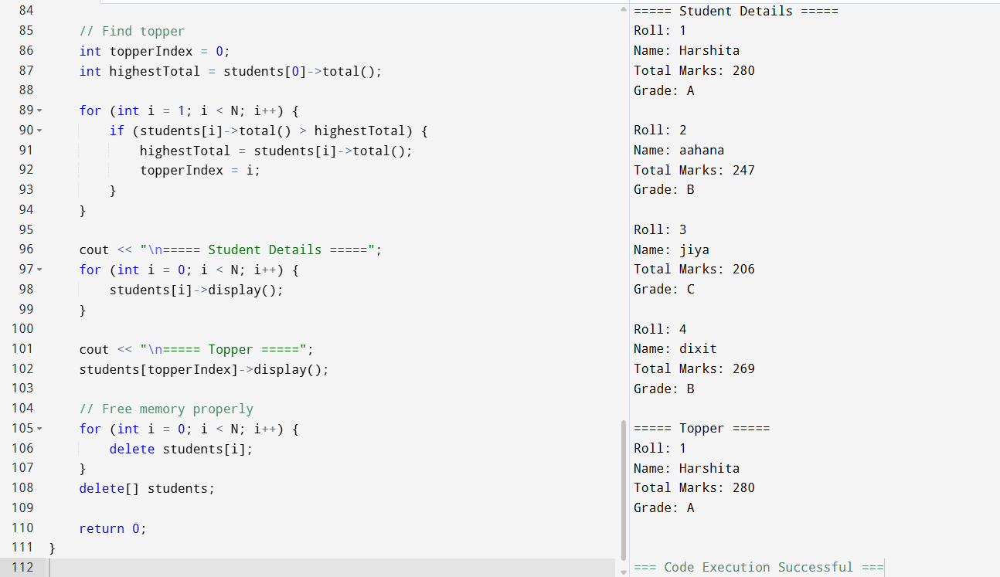
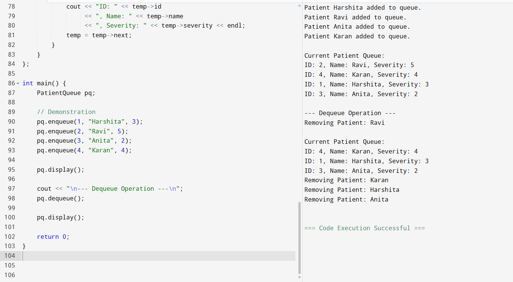
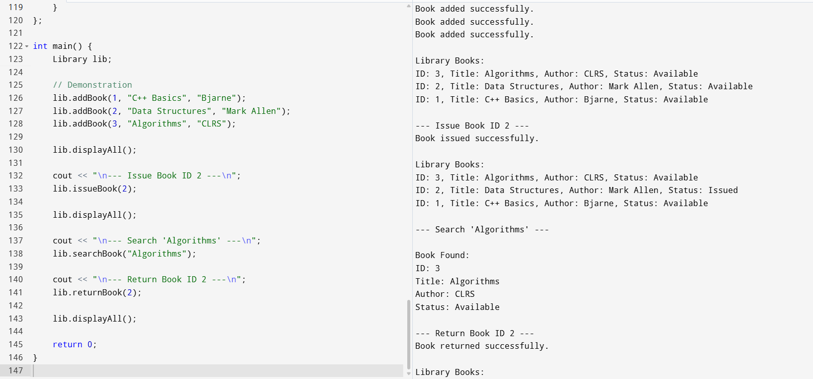
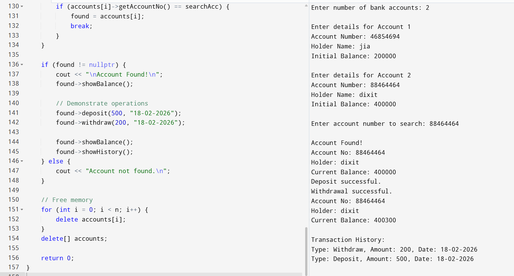
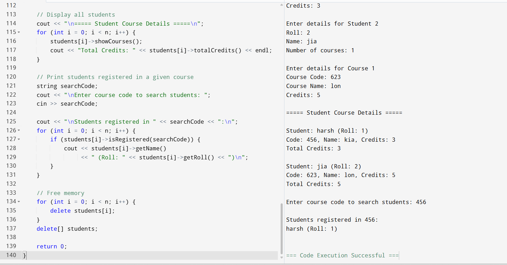
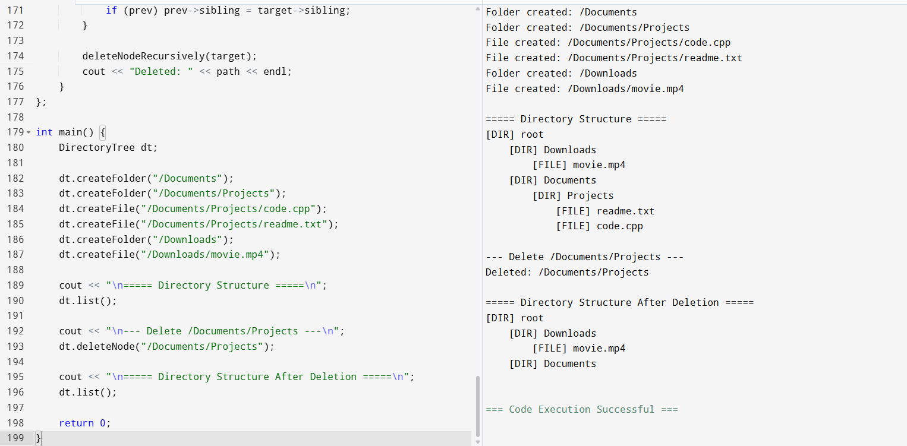

# cpp-18-02
# Create a Student class with attributes: name, roll number, and marks. Add member functions to input and display student details. Create at least 3 objects and display their data.

# Create a BankAccount class. Initialize account number and balance using a constructor. Display a message when the destructor is called. Create objects inside a function to observe destructor behavior.

# Create an Employee class.Make salary private.Provide getter and setter functions.Add validation: salary cannot be negative.

# Create a class Calculator Overload a function add() for: int double three parameters

# Create a struct Subject { string name; int marks; }. Create a class Student with: private: int roll; string name; Subject* subjects; int n; constructor allocates dynamic memory for n subjects member functions: input(), display(), total(), grade() Store N students using pointer to object array, find topper, and free all memory properly.

# Create a struct Node containing: Patient data (id, name, severity) Node* next Create a class PatientQueue implementing: enqueue (based on severity priority) dequeue display Use dynamic memory (new/delete) and demonstrate queue operations.

# Create a struct BookNode: int id; string title; string author; bool issued; BookNode* next Create a class Library with: BookNode* head addBook(), issueBook(id), returnBook(id), searchBook(title), displayAll() Use pointers to traverse linked list and manage memory safely.

# Create a struct Transaction: string type; double amount; string date; Transaction* next Create a class BankAccount: private: accountNo, holderName, balance, Transaction* historyHead deposit(), withdraw(), showHistory(), showBalance() Store multiple accounts using BankAccount* array pointer and search account by number.

# Create a struct Course: courseCode, courseName, credits Create a class Student: roll, name Course* registeredCourses (dynamic) registerCourses(), dropCourse(code), showCourses(), totalCredits() Store multiple students using pointers and print list of students registered in a given course.

# Create a struct DirNode: string name; bool isFile; DirNode* child; DirNode* sibling; Create a class DirectoryTree: createFolder(path), createFile(path) list(path) deleteNode(path) Implement using pointers (tree navigation) and free memory in destructor.
